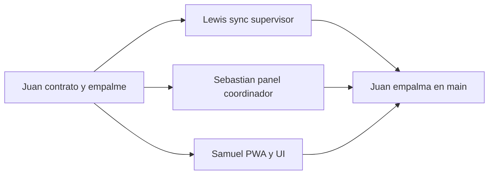

# Equipo y agentes

Un solo contrato para los cuatro agentes. Cada integrante abre este archivo y le dice a su agente que siga **solo su sección**.

Mapa en una frase: **Juan** contrato y empalme, **Lewis** sync del supervisor, **Sebastian** coordinación, **Samuel** UI de la PWA.

## Cómo usar este archivo

1. Abre el chat del agente en tu rama.
2. Pega: `Sigue únicamente la sección de [tu nombre] en EQUIPO.md. No edites carpetas de los demás.`
3. Si necesitas un campo nuevo en la base o en los tipos, pídeselo a Juan. No lo agregues tú.

## Cómo se evita el conflicto

Cada persona es dueña de carpetas distintas. Los archivos calientes (`prisma/schema.prisma`, `src/shared/types/index.ts`, `package.json`) tienen un solo dueño.

### Orden de trabajo

1. **Juan en `main`**, antes de que los demás abran rama: schema, migración, `src/shared/types/index.ts`, `src/shared/lib/prisma.ts`, `docker-compose.yml` y helpers de `upsert` por `clientId`. Cuando eso está en `main`, el contrato queda congelado.
2. **En paralelo**, tres ramas creadas desde ese `main`. Ninguna toca los mismos paths.
3. **Juan empalma** en este orden: Lewis, Sebastian, Samuel. Resuelve él solo `package.json` y el lockfile. Samuel prueba la PWA en `main` después del merge, sin resolver conflictos de git.

Ramas:

- `lewis/sync-supervisor`
- `sebastian/panel-coordinador`
- `samuel/pwa-ui`

Juan trabaja en `main` hasta el empalme.

### Reglas para todos los agentes

- Trabaja solo en tu rama y en las carpetas de tu sección.
- No reformatees archivos ajenos.
- No cambies firmas de `src/shared/types/index.ts`.
- Anota las dependencias en el PR. No corras installs que reescriban el lockfile al mismo tiempo que otro. Juan las instala al empalmar.
- El padre creado offline se referencia por `visitClientId` o `ownerClientId` (ya definido en los tipos). Lewis lo resuelve a `id` de servidor dentro de `syncOperation`.
- `src/app/api/` es de Lewis. El resto de `src/app/` es de Samuel.

---

## Juan — DB, ORM y empalme

Rol: dueño del contrato de datos y la única persona que integra en `main`.

Rama: `main`.

Puede editar:

- `prisma/schema.prisma`
- `prisma/migrations/`
- `prisma/seed.ts`
- `docker-compose.yml`
- `.env.example`
- `package.json`, `tsconfig.json`, `next.config.ts`, `postcss.config.mjs`, `.gitignore`
- `src/app/globals.css`
- `src/shared/lib/prisma.ts`
- `src/shared/lib/data.ts`
- `src/shared/types/index.ts`
- Helpers de acceso a datos con `upsert` por `clientId`, para que Lewis y Sebastian no escriban Prisma suelto ni se pisen el schema

No puede editar:

- `src/features/supervision/actions.ts` ni `src/app/api/` (Lewis)
- `src/features/coordinacion/actions.ts` ni `src/features/coordinacion/queries.ts` (Sebastian)
- Pantallas, componentes, Dexie, Zustand y `src/shared/ui/` (Samuel)

Sobre `src/app/layout.tsx`: es de Samuel, pero Juan lo toco una vez para agregar el `import "./globals.css"`. Ese import no se borra.

Entregable: schema migrado, tipos congelados, MySQL levantado y helpers de upsert listos **antes** de que los demás abran rama. Al final, empalme en el orden Lewis, Sebastian, Samuel.

Si alguien pide un campo, lo agregas tú en el schema y en `src/shared/types/index.ts`, y avisas. Ellos no tocan esos archivos.

---

## Lewis — backend del supervisor

Rol: sincronización idempotente de lo que el supervisor guarda offline, y subida de fotos.

Rama: `lewis/sync-supervisor`, creada desde `main` después del contrato de Juan.

Puede editar:

- `src/features/supervision/actions.ts` (`syncOperation`)
- Route Handlers bajo `src/app/api/` (fotos; hoy existe `src/app/api/ping/route.ts`)

No puede editar:

- `prisma/schema.prisma`, migraciones, `prisma/seed.ts`, `src/shared/types/index.ts`, `src/shared/lib/prisma.ts`, `src/shared/lib/data.ts` (Juan)
- `src/features/coordinacion/` (Sebastian)
- `src/features/supervision/offline/`, `store.ts`, `components/`, pantallas y `src/shared/ui/` (Samuel)

Entregable: `syncOperation` despacha al helper de Juan que corresponda según `op.type` y devuelve `SyncOperationResult`. El route handler de fotos guarda el archivo y devuelve la `url` que luego entra en la evidencia.

Regla 3 del SDD: el servidor es la entidad definitiva de verdad geografica. Cuando sincroniza un check-in o un check-out, corre `recalculateVisitGeofence(serverId, "checkIn" | "checkOut")` de `data.ts` y ese valor pisa el que midio el dispositivo. Samuel calcula en local solo para dar feedback inmediato.

Nada de esto bloquea la operacion (regla 3): si el supervisor esta fuera de rango, el check-in se guarda con `checkInOutOfRange = true` y el panel lo muestra como alerta (RF-PAN-08). No devuelvas un error al dispositivo por geolocalizacion.

Si el payload trae coordenadas nulas, `recalculateVisitGeofence` devuelve `null` y no toca los flags. Eso pasa cuando el usuario no concedio GPS (RNF-10) y es valido.

Helpers ya escritos en `src/shared/lib/data.ts`. No los reimplementes:

| `op.type` | Helper |
| --- | --- |
| `visit.upsert` | `upsertVisit(payload)` |
| `qrScan.upsert` | `upsertQrScan(payload)` |
| `novelty.upsert` | `upsertNovelty(payload)` |
| `evidence.upsert` | `upsertEvidence(payload)` |
| `checklistItem.upsert` | `upsertChecklistItemResult(payload)` |

Los helpers ya resuelven `visitClientId` y `ownerClientId` al `id` de servidor y tiran `DataError` con `PARENT_NOT_FOUND` o `OWNER_NOT_FOUND` si el padre no existe. `syncOperation` traduce ese `DataError` a `SyncOperationResult` con `ok: false` y el `error` como mensaje, para que el outbox pueda reintentar. Un padre ausente no es un error de codigo: no lo rechaces con excepcion, dejalo para el reintento.

Los codigos de `DataError` son `PARENT_NOT_FOUND`, `OWNER_NOT_FOUND`, `INVALID_PAYLOAD`, `NO_CHECKIN`, `INCOMPLETE_CHECKLIST` y `ALREADY_CHECKED_IN`.

Reglas que los helpers ya aplican y que no debes reimplementar:

- Nada se bloquea por estar fuera de rango (regla 3 del SDD): se guarda el flag y la operacion sigue.
- Un update de visita nunca pisa `supervisorId`, `costCenterId`, `scheduledAt`, `clientCreatedAt` ni `receivedAt`.
- Si la visita ya esta `CANCELLED`, `upsertVisit` no la reabre: devuelve la fila y `syncOperation` responde `ok: true`. Un payload con `status: CANCELLED` no cancela. Check-out sin check-in tira `NO_CHECKIN` y el outbox reintenta.
- Despues de un `visit.upsert` que no este cancelado, corre `recalculateVisitGeofence` si el payload trae `checkInAt` y, aparte, si trae `checkOutAt`.
- `POST /api/evidence` recibe `multipart` con el campo `file` y responde `{ url }`. Esa url entra luego en `evidence.upsert`.
- Un update de novedad nunca toca `status` ni los campos de cierre. El ciclo de vida es del coordinador (regla 4).
- `upsertChecklistItemResult` va por `(visitId, itemId)`, no por `clientId`: hay una sola respuesta por item y visita. Si el supervisor reanuda con otro `clientId`, actualiza en vez de duplicar.

Para convertir filas de Prisma a los tipos compartidos estan `toVisitDTO`, `toQrScanDTO`, `toNoveltyDTO`, `toChecklistItemResultDTO` y `toEvidenceDTO` en el mismo archivo.

No reescribas Dexie ni las pantallas. Samuel importa tu action; no la implementa.

---

## Sebastian — backend del coordinador

Rol: lecturas y mutaciones del panel de escritorio.

Rama: `sebastian/panel-coordinador`, creada desde `main` después del contrato de Juan.

Puede editar:

- `src/features/coordinacion/actions.ts`
- `src/features/coordinacion/queries.ts`

Ahí viven la asignación de visitas, la gestión de códigos QR, los KPIs y las lecturas que el panel consulta por polling.

No puede editar:

- `prisma/schema.prisma`, migraciones, `prisma/seed.ts`, `src/shared/types/index.ts`, `src/shared/lib/prisma.ts`, `src/shared/lib/data.ts` (Juan)
- `src/features/supervision/actions.ts` ni `src/app/api/` (Lewis)
- Pantallas, mapas, tablas, Dexie y `src/shared/ui/` (Samuel)

Entregable: actions de asignación y QR, y queries listas para que el dashboard las llame. `queries.ts` no lleva `"use server"`: son lecturas importadas desde Server Components. Las mutaciones sí van en `actions.ts` con `"use server"`.

Dos cosas que cambian como se consulta la base:

- Las lecturas que devuelves al dashboard van envueltas en los DTO de Juan (`toVisitDTO`, `toQrScanDTO`, `toNoveltyDTO`, `toChecklistItemResultDTO`, `toEvidenceDTO`, en `src/shared/lib/data.ts`). Así el cliente recibe fechas ISO-8601 y no objetos `Date` de Prisma.
- `prisma` se importa desde `@/shared/lib/prisma`. Es el cliente con singleton, no instancies `PrismaClient`.
- CA-05: el panel muestra `clientCreatedAt`, que es la hora en campo. `receivedAt` solo sirve para auditar cuándo llegó al servidor.

Helpers de Juan que te sirven, todos en `src/shared/lib/data.ts`:

| Para qué | Función |
| --- | --- |
| KPIs (RF-PAN-01) | leer `Visit` y contar por `status` |
| Alertas de GPS (RF-PAN-08) | filtrar por `checkInOutOfRange: true` |
| Closing de novedades (RF-NOV-04, CA-07) | `changeNoveltyStatus(id, status, { closedById, resolutionAction })` |
| Plantilla por centro de costo (RF-ASI-03) | `assignChecklistTemplateToCostCenter(costCenterId, templateId)` |
| Estado del checklist (RF-PAN-07) | `findPendingRequiredItems(visitId)` y `getVisitChecklist(visitId)` |

`changeNoveltyStatus` con `RESOLVED` exige `closedById` y `resolutionAction`, y tira `DataError` con `INVALID_PAYLOAD` si faltan. Los tres datos de la regla 4 van juntos o ninguno. La validación ya está hecha: no la repitas. El panel la llama a traves de `updateNoveltyStatus`.

RF-ASI-01 ya cabe en el contrato. `Visit.scheduledAt` es la fecha y hora programada (nullable). `VisitStatus` incluye `CANCELLED`. Esas dos cosas las escribe el coordinador con `createAssignedVisit`, `updateVisitAssignment` y `cancelVisit` en `actions.ts`. No uses `upsertVisit` para asignar: no guarda `scheduledAt` y no cancela. El sync del celular no revierte una cancelacion ni pisa el horario.

QrPoint lleva `isActive` (RF-QR-02). Desactivar es cambiar el flag, nunca borrar la fila: RF-QR-06 distingue "existe pero está inactivo" de "no existe". El radio por defecto es 50 m, no 30.

Si una query necesita logica de negocio que no sea lectura, va en `actions.ts`, no en `queries.ts`.

No toques la UI. Samuel importa tus funciones desde las páginas del coordinador.

---

## Samuel — frontend

Rol: PWA móvil del supervisor y panel desktop del coordinador.

Rama: `samuel/pwa-ui`, creada desde `main` después del contrato de Juan.

Puede editar:

- `src/app/(auth)/`
- `src/app/(supervisor)/`
- `src/app/(coordinador)/`
- `src/app/layout.tsx`
- `src/features/supervision/components/`
- `src/features/supervision/offline/` (`db.ts`, `outbox.ts`, `qrLookup.ts`, `geo.ts`)
- `src/features/supervision/store.ts`
- `src/features/coordinacion/components/`
- `src/shared/ui/`

No puede editar:

- `prisma/schema.prisma`, migraciones, `prisma/seed.ts`, `src/shared/types/index.ts`, `src/shared/lib/prisma.ts`, `src/shared/lib/data.ts` (Juan)
- `src/features/supervision/actions.ts` ni `src/app/api/` (Lewis)
- `src/features/coordinacion/actions.ts` ni `src/features/coordinacion/queries.ts` (Sebastian)

Entregable: pantallas mobile-first del supervisor (visitas, escáner, evidencias por QR) y panel del coordinador (dashboard, asignaciones, novedades). El offline es tuyo: outbox en Dexie, fotos locales, caché de QR y Haversine. Zustand solo para estado de UI.

Dos notas sobre el arranque, ya resuelto por Juan:

- `src/app/globals.css` ya importa Tailwind v4 y `src/app/layout.tsx` ya lo importa. Usa clases utilitarias, no hace falta CSS aparte.
- Tailwind no trae los estilos de `<a>`, `<button>` ni `<h1>` por defecto. Si un control te sale sin fondo ni padding, es falta de clases, no un problema de configuracion.

Login (RF-AUT-01). Juan ya dejo el hash con scrypt en `src/shared/lib/password.ts`:

- `supervisor@demo.test` / `supervisor123`
- `coordinador@demo.test` / `coordinador123`

Usá `verifyPassword(plain, stored)` de ahi. Nunca compares contrasenas con `===` y nunca mandes el `passwordHash` al cliente: el tipo `User` de `shared/types` no lo expone a proposito.

## Datos de operacion para desarrollar y para la demo

`npm run db:seed` siembra un mes de operacion sintetica pero coherente, no tres filas de prueba. Es idempotente: borra la operacion y la reconstruye, asi que se puede volver a correr las veces que haga falta.

Que queda en la base:

| Tabla | Volumen | Para que sirve |
| --- | --- | --- |
| `User` | 6 supervisores + 2 coordinadores | RF-PAN-01 supervisores activos y asignados |
| `CostCenter` | 6, con direccion y coordenadas | RF-ASI-02, mapa |
| `QrPoint` | 18 (2 inactivos) | RF-QR-02, hoja imprimible |
| `ChecklistTemplate` | 3, con 14 items en total | RF-SUP-01, RF-ASI-03 |
| `Visit` | ~100 en 30 dias: ~60 completadas, ~30 pendientes, 3 en ruta, ~7 canceladas | RF-PAN-01, historial, KPIs |
| `QrScan` | ~120, 20 de ellos no verificados | RF-QR-03 |
| `Novelty` | ~21 con los cuatro estados y prioridades | RF-NOV-02, bandeja de alertas |
| `Evidence` | ~120 sobre los cuatro duenos | RF-PAN-05 galeria |
| `ChecklistItemResult` | ~255 con items sin cumplir y sin marcar | RF-PAN-07, CA-02 |

Lo que el seed garantiza, porque el panel depende de ello:

- `clientCreatedAt` nunca es posterior a `receivedAt`. Lo historico llega con minutos u horas de atraso (RF-OFF-04), no todo con la hora del seed.
- Las visitas de hoy incluyen dos supervisores `IN_PROGRESS`, para que el mapa y la bandeja de rutas tengan algo vivo que mostrar.
- Hay visitas con check-in fuera de rango, visitas demoradas y visitas canceladas. Los tres son estados que el panel tiene que Differenciar.
- Los KPIs no dan 100 %: el checklist queda en ~64 % y el GPS verificado en ~86 %. Un panel donde todo esta perfecto no se puede demoear.
- Toda novedad `RESOLVED` trae `closedAt`, `closedById` y `resolutionAction` (CA-07).
- Ninguna evidencia queda huerfana: los cuatro `ownerType` resuelven a una fila real, que es la unica red que hay porque `Evidence` no tiene FK.

Sobre el checklist (RF-SUP-01/02, CA-02):

Sobre el checklist (RF-SUP-01/02, CA-02):

- La plantilla y sus items son del coordinador. El supervisor solo marca.
- Un item sin marcar NO tiene fila en la base. Lo pendiente se deduce de la plantilla con `findPendingRequiredItems`. No esperes encontrar filas en PENDING.
- Cada marca genera un `checklistItem.upsert` en el outbox. El `clientId` es el de la fila que creo Juan en el dispositivo; el servidor lo resuelve por `(visita, item)`.
- La PWA precarga la plantilla y sus items (RF-OFF-01) para poder diligenciar en modo avion.

Sobre las dos fechas de todo payload (regla 5, CA-05): mandá `clientCreatedAt` con la hora real del dispositivo cuando ocurrio el hecho. Si la mandas con la hora de ahora, el panel va a mentir. El `receivedAt` lo pone el servidor, no lo envies.

Importa `syncOperation` y las queries del coordinador. No reescribas esas funciones. Separa UI (`"use client"`) de servidor (`"use server"`).

Después del empalme, recorre en `main` login, visitas, escáner y dashboard. No resuelvas conflictos de git: eso es de Juan.

---

## Empalme (Juan)

Orden de merge a `main`:

1. `lewis/sync-supervisor`
2. `sebastian/panel-coordinador`
3. `samuel/pwa-ui`

Checklist:

- Cada entidad creada en el dispositivo hace `upsert` por `clientId` (`Visit`, `QrScan`, `Novelty`, `Evidence`) o por `(visitId, itemId)` (`ChecklistItemResult`).
- `visitClientId` y `ownerClientId` quedan resueltos a `id` de servidor antes de guardar hijos.
- `syncOperation` traduce `DataError` a `SyncOperationResult` con `ok: false` (no lanza excepciones para padres ausentes).
- `recalculateVisitGeofence` se corre en cada sync de check-in y check-out, y el resultado del servidor pisa el del dispositivo.
- Un sync de novedad nunca reabre una novedad cerrada.
- Un sync de visita nunca reabre una visita `CANCELLED` ni pisa `scheduledAt`.
- Las páginas importan las actions y las queries reales, no stubs.
- `package.json` y el lockfile se instalan una sola vez, con las dependencias anotadas en los tres PR.
- Samuel prueba en `main`: login, visitas, escáner QR y dashboard.
- El build (`npm run build`) pasa y `npx tsc --noEmit` sin errores después de todos los merges.
