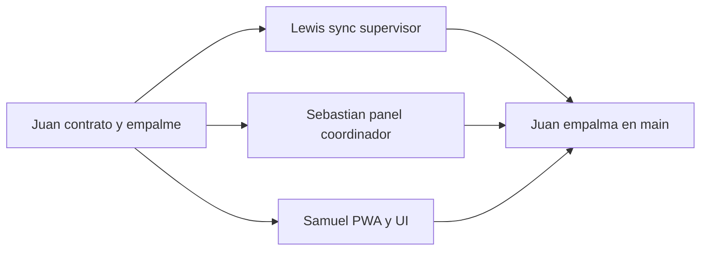

# Equipo y agentes

Un solo contrato para los cuatro agentes. Cada integrante abre este archivo y le dice a su agente que siga **solo su sección**.

Mapa en una frase: **Juan** contrato y empalme, **Lewis** sync del supervisor, **Sebastian** coordinación, **Samuel** UI de la PWA.

## Cómo usar este archivo

1. Abre el chat del agente en tu rama.
2. Pega: `Sigue únicamente la sección de [tu nombre] en EQUIPO.md. No edites carpetas de los demás.`
3. Si necesitas un campo nuevo en la base o en los tipos, pídeselo a Juan. No lo agregues tú.

## Cómo se evita el conflicto

Cada persona es dueña de carpetas distintas. Los archivos calientes (`prisma/schema.prisma`, `src/shared/types/index.ts`, `package.json`) tienen un solo dueño.

### Orden de trabajo

1. **Juan en `main`**, antes de que los demás abran rama: schema, migración, `src/shared/types/index.ts`, `src/shared/lib/prisma.ts`, `docker-compose.yml` y helpers de `upsert` por `clientId`. Cuando eso está en `main`, el contrato queda congelado.
2. **En paralelo**, tres ramas creadas desde ese `main`. Ninguna toca los mismos paths.
3. **Juan empalma** en este orden: Lewis, Sebastian, Samuel. Resuelve él solo `package.json` y el lockfile. Samuel prueba la PWA en `main` después del merge, sin resolver conflictos de git.

Ramas:

- `lewis/sync-supervisor`
- `sebastian/panel-coordinador`
- `samuel/pwa-ui`

Juan trabaja en `main` hasta el empalme.

### Reglas para todos los agentes

- Trabaja solo en tu rama y en las carpetas de tu sección.
- No reformatees archivos ajenos.
- No cambies firmas de `src/shared/types/index.ts`.
- Anota las dependencias en el PR. No corras installs que reescriban el lockfile al mismo tiempo que otro. Juan las instala al empalmar.
- El padre creado offline se referencia por `visitClientId` o `ownerClientId` (ya definido en los tipos). Lewis lo resuelve a `id` de servidor dentro de `syncOperation`.
- `src/app/api/` es de Lewis. El resto de `src/app/` es de Samuel.

---

## Juan — DB, ORM y empalme

Rol: dueño del contrato de datos y la única persona que integra en `main`.

Rama: `main`.

Puede editar:

- `prisma/schema.prisma`
- `prisma/migrations/`
- `docker-compose.yml`
- `.env.example`
- `src/shared/lib/prisma.ts`
- `src/shared/types/index.ts`
- Helpers de acceso a datos con `upsert` por `clientId`, para que Lewis y Sebastian no escriban Prisma suelto ni se pisen el schema

No puede editar:

- `src/features/supervision/actions.ts` ni `src/app/api/` (Lewis)
- `src/features/coordinacion/actions.ts` ni `src/features/coordinacion/queries.ts` (Sebastian)
- Pantallas, componentes, Dexie, Zustand y `src/shared/ui/` (Samuel)

Entregable: schema migrado, tipos congelados, MySQL levantado y helpers de upsert listos **antes** de que los demás abran rama. Al final, empalme en el orden Lewis, Sebastian, Samuel.

Si alguien pide un campo, lo agregas tú en el schema y en `src/shared/types/index.ts`, y avisas. Ellos no tocan esos archivos.

---

## Lewis — backend del supervisor

Rol: sincronización idempotente de lo que el supervisor guarda offline, y subida de fotos.

Rama: `lewis/sync-supervisor`, creada desde `main` después del contrato de Juan.

Puede editar:

- `src/features/supervision/actions.ts` (`syncOperation`)
- Route Handlers bajo `src/app/api/` (fotos; hoy existe `src/app/api/ping/route.ts`)

No puede editar:

- `prisma/schema.prisma`, migraciones, `src/shared/types/index.ts`, `src/shared/lib/prisma.ts` (Juan)
- `src/features/coordinacion/` (Sebastian)
- `src/features/supervision/offline/`, `store.ts`, `components/`, pantallas y `src/shared/ui/` (Samuel)

Entregable: `syncOperation` hace `prisma.upsert` por `clientId` usando los helpers de Juan. Resuelve `visitClientId` y `ownerClientId` al `id` de servidor. El route handler de fotos guarda el archivo y devuelve la `url` que luego entra en la evidencia.

No reescribas Dexie ni las pantallas. Samuel importa tu action; no la implementa.

---

## Sebastian — backend del coordinador

Rol: lecturas y mutaciones del panel de escritorio.

Rama: `sebastian/panel-coordinador`, creada desde `main` después del contrato de Juan.

Puede editar:

- `src/features/coordinacion/actions.ts`
- `src/features/coordinacion/queries.ts`

Ahí viven la asignación de visitas, la gestión de códigos QR, los KPIs y las lecturas que el panel consulta por polling.

No puede editar:

- `prisma/schema.prisma`, migraciones, `src/shared/types/index.ts`, `src/shared/lib/prisma.ts` (Juan)
- `src/features/supervision/actions.ts` ni `src/app/api/` (Lewis)
- Pantallas, mapas, tablas, Dexie y `src/shared/ui/` (Samuel)

Entregable: actions de asignación y QR, y queries listas para que el dashboard las llame. `queries.ts` no lleva `"use server"`: son lecturas importadas desde Server Components. Las mutaciones sí van en `actions.ts` con `"use server"`.

No toques la UI. Samuel importa tus funciones desde las páginas del coordinador.

---

## Samuel — frontend

Rol: PWA móvil del supervisor y panel desktop del coordinador.

Rama: `samuel/pwa-ui`, creada desde `main` después del contrato de Juan.

Puede editar:

- `src/app/(auth)/`
- `src/app/(supervisor)/`
- `src/app/(coordinador)/`
- `src/app/layout.tsx`
- `src/features/supervision/components/`
- `src/features/supervision/offline/` (`db.ts`, `outbox.ts`, `qrLookup.ts`, `geo.ts`)
- `src/features/supervision/store.ts`
- `src/features/coordinacion/components/`
- `src/shared/ui/`

No puede editar:

- `prisma/schema.prisma`, migraciones, `src/shared/types/index.ts`, `src/shared/lib/prisma.ts` (Juan)
- `src/features/supervision/actions.ts` ni `src/app/api/` (Lewis)
- `src/features/coordinacion/actions.ts` ni `src/features/coordinacion/queries.ts` (Sebastian)

Entregable: pantallas mobile-first del supervisor (visitas, escáner, evidencias por QR) y panel del coordinador (dashboard, asignaciones, novedades). El offline es tuyo: outbox en Dexie, fotos locales, caché de QR y Haversine. Zustand solo para estado de UI.

Importa `syncOperation` y las queries del coordinador. No reescribas esas funciones. Separa UI (`"use client"`) de servidor (`"use server"`).

Después del empalme, recorre en `main` login, visitas, escáner y dashboard. No resuelvas conflictos de git: eso es de Juan.

---

## Empalme (Juan)

Orden de merge a `main`:

1. `lewis/sync-supervisor`
2. `sebastian/panel-coordinador`
3. `samuel/pwa-ui`

Checklist:

- Cada entidad creada en el dispositivo hace `upsert` por `clientId` (`Visit`, `QrScan`, `Novelty`, `Evidence`).
- `visitClientId` y `ownerClientId` quedan resueltos a `id` de servidor antes de guardar hijos.
- Las páginas importan las actions y las queries reales, no stubs.
- `package.json` y el lockfile se instalan una sola vez, con las dependencias anotadas en los tres PR.
- Samuel prueba en `main`: login, visitas, escáner QR y dashboard.
